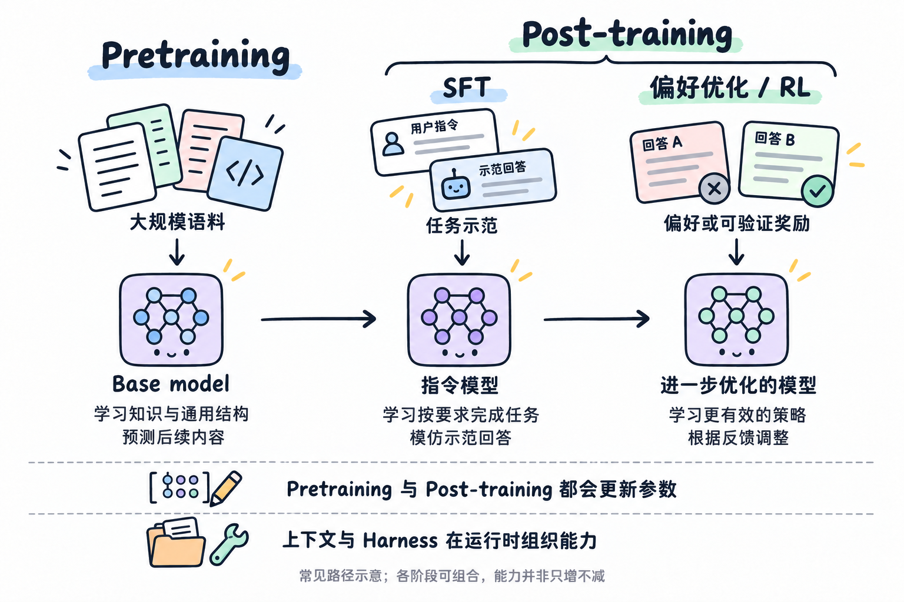
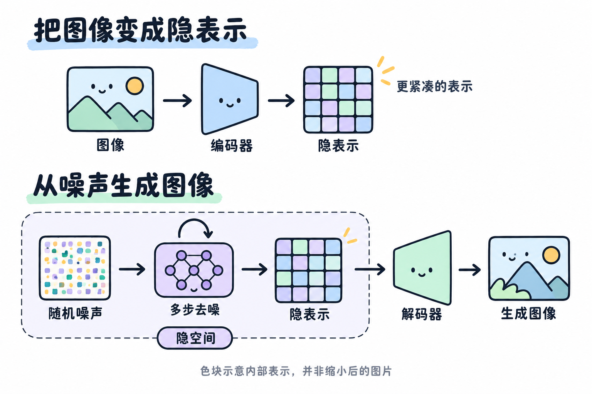

# 压缩即智能：从大模型到 Harness

## 一、压缩与泛化

自回归语言模型估计的是：给定前面的内容，下一个 token 出现的条件概率。Pretrain 在大规模语料上提高真实后续内容的预测概率，生成时再依据预测分布选择 token。**概率描述的是预测形式，并不限定实现预测的计算机制。** 把 next-token prediction 理解成无记忆的词频匹配，忽略了模型可以学习如何利用历史信息。

预测与压缩有严格的联系。编解码双方共享一个概率模型时，高概率事件可以用更短的编码表示；一段序列的理想编码长度对应模型赋予它的负对数概率。因此，降低语言模型的交叉熵，也是在缩短利用该模型编码数据所需的平均长度。[Language Modeling Is Compression](https://arxiv.org/abs/2309.10668) 讨论了这种对应关系。

Ilya Sutskever 在 [NVIDIA GTC 2023](https://www.nvidia.com/en-us/on-demand/session/gtcspring23-s52092/) 中说：

> “If you compress the data really well, you must extract all the hidden secrets which exist in it.”

共享的结构能够同时降低多个样本的预测误差，因而为学习提供反复出现的信号。当这些结构适用于未见过的数据时，预测能力就能从训练样本迁移到新输入。通用预测目标因此可能促成可复用能力，但并不保证模型学到的就是预期机制。

**预测与压缩的联系可以量化，“压缩即智能”仍是对能力形成的解释。** 模型也可能靠记忆、偏差或捷径降低训练误差。能否处理未见过的组合，才区分了样本记忆与可迁移的规律。数据提供可学习的结构，模型与计算决定学习的条件。

## 二、规模与能力迁移

通用预测目标可以包含许多任务。文本中既有叙述，也有问答、证明、代码和跨语言对照。预测这些内容的后续，可能需要利用其中的任务关系；一条训练目标因此可以为多种能力提供学习信号。

[GPT-3 的翻译实验](https://arxiv.org/html/2005.14165v4#S3.SS3)说明了这种迁移：模型未经翻译任务专门微调，也能根据任务描述和示例完成翻译。它的 pretrain 数据混合了多种语言，补充少量翻译示例又能改善表现。这里的“自动出现”，指任务能力从通用训练中获得，并非脱离数据凭空产生。

规模扩大能让这种学习走得更远。[Scaling laws](https://arxiv.org/abs/2001.08361) 描述了特定实验条件下，模型规模、数据量、训练计算量与 loss 的近似幂律关系。但平均预测误差改善，不等于每项任务都按同样速度进步。

[涌现能力](https://arxiv.org/abs/2206.07682)描述的是某些能力随规模增长才显著表现出来。但离散评分和判定阈值，也可能把连续的能力改善呈现为突变。[相关研究](https://arxiv.org/abs/2304.15004)表明，部分跃升可以由评估指标解释。判断新能力是否出现，需要检查具体行为，而不能只看分数曲线的形状。

这些实验说明，pretrain 已经可以形成具体任务能力。但具备翻译、问答或编程能力，并不等于在面对用户请求时，总能稳定地调用它们。

## 三、从 Base model 到助手

Pretrain 得到的 base model 已经能学习知识、语言结构和一定的任务能力，但训练目标是预测文本的后续，并没有把每段输入都定义成“用户交给助手的任务”。因此，同一段输入之后，是接答案、补例子还是继续叙述，会受到文本格式和上下文影响。Base model 可以通过示例完成任务，能力的存在与调用的稳定性是两个维度。

SFT（监督微调）把“用户指令—期望回答”作为示范，继续训练模型预测回答部分的 token。它通常沿用语言建模的预测形式，改变的是数据和被强化的行为：从广泛的文本续写，转向按任务要求生成回答。问答、输出格式、澄清问题和工具调用，都可以通过相应示范训练。[InstructGPT](https://arxiv.org/abs/2203.02155) 使用了这类训练流程。

SFT 让按指令作答的行为进入训练目标，减少调用能力时对 prompt 格式的依赖。它也会更新参数，能够训练领域知识和具体技能，效果取决于示范内容，不能只理解为修改语气。

SFT 属于 post-train，后者还可以包括偏好优化和强化学习（RL）。示范给出目标回答，偏好数据与可验证奖励则评价模型输出，为更新参数提供依据。[DeepSeek-R1 的研究](https://arxiv.org/abs/2501.12948)展示了 RL 对推理表现的提升，以及自检、反思等行为的发展。Post-train 既能改善指令遵循，也能改变解决问题的策略。

这几个阶段没有绝对的能力分界，也不保证所有能力同步提高。判断变化应看具体任务：是否更遵循指令、是否更准确、是否能在新问题上迁移。**Pretrain 与 post-train 改变模型参数；通常的上下文输入与 Harness 运行，改变的是本次任务的条件和过程。**

## 四、目标、上下文与状态

模型在训练中学到的常见偏好，不能替代当前任务的目标。目标、约束和优先级限定了可接受的答案；这些条件缺失时，即使生成内容合理，也未必符合实际意图。

目标进入模型之前，还要经过表达。直觉和经验包含大量默认前提，语言只传递其中一部分。具体约束、输入输出示例和验收条件，能把隐含要求变成可用的信息。即便输入接口换成脑信号转文本，识别出字句之后，仍要处理语境、歧义和未明确的取舍。

上下文将目标与当前事实交给模型。参数没有更新，条件概率分布却可以改变，生成因而可能转向符合约束的方案。Few-shot 示例还能提供任务格式和映射关系。**上下文的价值，在于补足区分答案所需的信息。**

Attention 让当前位置的表示能够利用上下文中的相关内容。机制可解释性（mechanistic interpretability）进一步追问：哪些内部组件在读取信息，它们执行了什么计算？[Induction heads](https://transformer-circuits.pub/2022/in-context-learning-and-induction-heads/) 是其中一项发现：某些 attention heads 会匹配当前 token 在前文的出现位置，读取当时紧随其后的 token，并提高它再次出现的概率。这种机制能够复用本次上下文中新出现的关联。

这里，参数学到的是匹配与复制的规则，当前上下文提供的是被检索的内容；无需更新参数，就能让先前出现的信息影响后续预测。这为 in-context learning 提供了可分析的内部机制。相关研究在小型 attention-only 模型中给出了较直接的因果证据，但不能据此把大型模型的全部 in-context learning 都归因于 induction heads。

**概率模型与记忆机制并不矛盾，上下文记忆也不等于永久记忆。** 这种检索依赖仍可访问的上下文，既不保证长距离信息都能被准确利用，也不会自动把本次关联写入参数。Context engineering 因此需要处理信息的保留、时效、冲突和来源，组织当前决策所需的内容。

长任务中的摘要也是一次有损压缩，保留标准是信息是否影响后续决策。从马尔可夫的角度看，状态充分意味着：给定当前状态，历史不再提供额外的预测信息。摘要若遗漏关键约束，就不能据此把历史当作无关信息丢弃。

## 五、表示与推理计算

在 [Transformer](https://arxiv.org/abs/1706.03762) 中，token 被映射为向量，再通过多层计算形成依赖上下文的隐藏表示。参数是训练留下的结果，隐藏表示是处理当前输入时产生的状态。通常的推理不会更新参数，却会不断改变这些状态。

参数固定后，仍可用更多计算处理当前问题。生成中间步骤，会把中间结果加入后续上下文；生成多个候选再筛选，则把一次作答变成搜索。两者能否提高成功率，取决于候选是否有用，以及筛选方法能否识别较好的答案。[Test-time compute 的研究](https://arxiv.org/abs/2408.03314)因此关注计算如何分配，而不仅是增加多少。

计算也可以发生在文字之外。Latent space（隐空间）描述潜在表示所在的空间，并不要求每个中间状态都能写成一句话。[Looped Transformer 的相关研究](https://arxiv.org/abs/2502.05171)通过反复运行循环模块来更新隐藏状态，增加推理时的计算深度。因此，最终输出长度不足以衡量模型实际做了多少计算。

**延伸：隐空间中的生成。** [Latent diffusion](https://arxiv.org/abs/2112.10752) 将图像编码为紧凑的隐表示，在其中学习和执行多步去噪，最后解码成图像，以减少反复处理高分辨率像素的开销。它与 Looped Transformer 的机制不同，内部计算同样可以在与输出不同的表示空间中进行。

隐空间本身不保证更强的能力，也不一定比输入维度更低；[diffusion](https://arxiv.org/abs/2006.11239) 也可以直接在像素空间运行。无论采用哪种表示，计算都要有合适的输入和判断标准。已有信息没有被充分推导，可以增加计算；必要事实尚未获得，则需要先获取信息。

## 六、Harness 与执行反馈

模型输出 tool call 后，外部程序需要解析请求、实际执行、收集结果，再把结果交回模型。Harness 将这些步骤组织成持续运行的过程，并管理状态、权限、重试、预算和停止条件。Agent 框架提供实现这些机制的组件。

执行结果需要连同相关条件回到上下文，模型才能判断原有假设是否成立、方案是否需要调整。运行循环的价值取决于每轮能否获得有效信息，以及这些信息能否改变后续决策；重复调用本身不保证进展。

**同样是反馈，训练阶段用它更新参数，运行阶段通常用它更新上下文。** 前者改变模型在后续任务中的行为倾向，后者让当前任务的下一轮判断有了新依据。一次工具执行成功，并不会自动成为模型永久掌握的知识；若要跨任务保留，需要外部记忆或另行训练。

验证之所以必要，是因为生成概率与方案有效性不是同一个量。低信息熵只表示预测分布集中，不能证明输出正确，也不能与热力学熵增混作一个概念。检查器和测试提供外部依据，但它们的结论仍受验证范围限制。

Andrej Karpathy 在 [Software 2.0](https://karpathy.medium.com/software-2-0-a64152b37c35) 中写道：

> “Software 1.0 is code we write. Software 2.0 is code written by the optimization based on an evaluation criterion.”

[Software 3.0](https://www.youtube.com/watch?v=LCEmiRjPEtQ)进一步把自然语言作为编程接口。Agent 将几种形式组合起来：程序执行操作，训练得到的参数参与判断，自然语言说明目标与约束。它们分别承担执行、学习和表达的工作。

机制可解释性研究模型内部如何计算，Harness 的执行记录则让外部过程可追踪：约定是否进入上下文、工具是否执行成功、结果是否送回。这些记录不能证明模型正确理解了信息，却能帮助定位失败发生在哪一环。先区分目标是否清楚、信息是否齐全、计算是否充分、验证是否有效，再判断是否需要改进模型能力。
